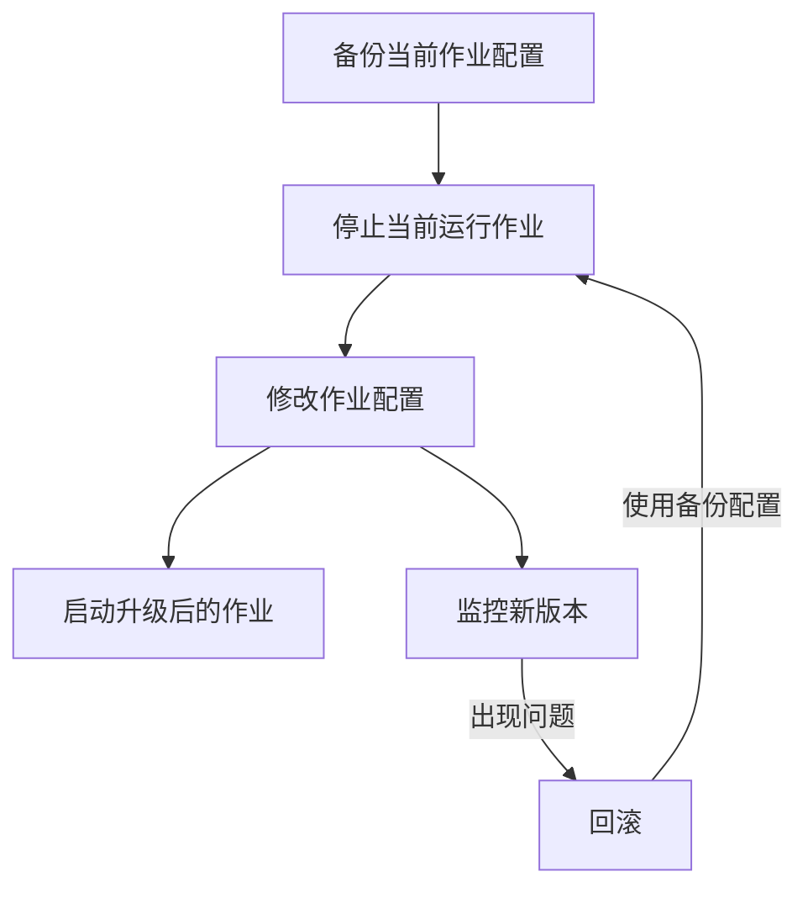

<div align="center">
  <h1>🚀 Flink Automation Toolkit</h1>
  <p><strong>一站式Apache Flink作业管理与自动化工具集</strong></p>
  <p>
    
    
    
    
  </p>
</div>

<p align="center">
  <a href="#核心特性">核心特性</a> •
  <a href="#快速开始">快速开始</a> •
  <a href="#工具集详解">工具集详解</a> •
  <a href="#使用场景示例">使用场景示例</a> •
  <a href="#高级配置">高级配置</a> •
  <a href="#开发与贡献">开发与贡献</a>
</p>

---

## 📋 项目简介

**Flink Automation Toolkit** 是一套强大的自动化工具集，通过与Flink REST API交互，简化Flink作业的管理和运维工作。无论是大规模作业迁移，集群版本升级，还是日常作业管理，本工具集都能显著提升效率，减少人为错误。

### 为什么选择Flink Automation Toolkit?

- **效率提升**：实现批量作业迁移部署，一键操作，节省数小时重复工作
- **风险降低**：支持干运行模式，可预览操作结果，减少生产环境误操作
- **一致性保证**：保存作业配置和状态，确保环境一致性和回滚能力
- **易于扩展**：模块化设计，便于集成到CI/CD流程或扩展更多功能

---

## ✨ 核心特性

<table>
  <tr>
    <td><b>🔍 智能作业处理</b></td>
    <td>
      • 自动识别SQL和ETL作业类型<br/>
      • 提取作业配置、状态和依赖关系<br/>
      • 保存原始数据支持历史重放
    </td>
  </tr>
  <tr>
    <td><b>🚀 高效批量操作</b></td>
    <td>
      • 一键启动/停止多个作业<br/>
      • 支持作业间依赖序列控制<br/>
      • 细粒度间隔控制防止集群压力
    </td>
  </tr>
  <tr>
    <td><b>🔄 环境迁移适配</b></td>
    <td>
      • 跨环境配置转换<br/>
      • 智能替换资源地址和参数<br/>
      • 保留作业状态和savepoint
    </td>
  </tr>
  <tr>
    <td><b>📊 全面日志监控</b></td>
    <td>
      • 详细操作日志记录<br/>
      • 异常处理和重试机制<br/>
      • 作业状态变更跟踪
    </td>
  </tr>
  <tr>
    <td><b>🔒 安全可控操作</b></td>
    <td>
      • 干运行模式预览变更<br/>
      • 精细权限控制<br/>
      • 作业配置备份与恢复
    </td>
  </tr>
</table>

---

## 🚀 快速开始

### 系统要求

- Python 3.7+
- 可访问Flink REST API的网络环境
- Flink 1.13+集群（更早版本可能部分功能受限）

### 安装方法

1. 克隆仓库
   ```bash
   git clone https://github.com/mologus/flink-automation-toolkit.git
   cd flink-automation-toolkit
   ```

2. 安装依赖
   ```bash
   pip install -r requirements.txt
   ```

3. 配置API连接
   ```bash
   # 编辑src/config.py或使用命令行参数
   # 默认配置使用http://127.0.0.1:8081作为Flink API地址
   ```

### 使用示例

**提取所有完成状态作业的配置**
```bash
python flink_job_processor.py --all
# 输出保存在output/processed_jobs.json
```

**批量启动所有已提取的作业**
```bash
python flink_job_starter.py --all --dry-run    # 预览模式
python flink_job_starter.py --all              # 实际执行
```

**批量停止正在运行的作业**
```bash
python flink_job_stopper.py --all --interval 10
```

---

## 🔧 工具集详解

本工具集包含多个专用工具，每个工具都针对Flink作业生命周期的不同方面进行优化。

### 📝 作业处理器 (flink_job_processor.py)

**功能**: 从Flink集群获取作业信息，处理并转换为可重用格式

**关键特性**:
- 智能区分SQL作业和ETL作业
- 提取savepoint路径以支持有状态迁移
- 支持原始数据存档和历史重放
- 支持自动配置类型检测和规范化

**使用示例**:
```bash
# 获取所有完成状态作业
python flink_job_processor.py --all

# 获取特定作业ID的配置
python flink_job_processor.py --job-id ce38fe58413a61c4b2250594ff816bb9

# 使用历史数据重放而不查询API
python flink_job_processor.py --all --replay --replay-timestamp 20250423_162526
```

### 🚀 作业启动器

#### SQL作业启动器 (flink_job_starter.py)
**功能**: 批量启动SQL类型作业，使用通用JAR包

**使用示例**:
```bash
# 启动所有处理后的SQL作业
python flink_job_starter.py --all

# 启动特定作业
python flink_job_starter.py --job-id job1,job2 --jar-id your-common-jar.jar
```

#### ETL作业启动器 (flink_etl_starter.py) 
**功能**: 批量启动ETL类型作业，每个作业使用特定JAR包

**使用示例**:
```bash
# 启动所有ETL作业
python flink_etl_starter.py --all

# 启动指定ETL作业
python flink_etl_starter.py --job-name etl_marketing_job,game_job_1
```

### 🛑 作业停止器 (flink_job_stopper.py)

**功能**: 安全地批量停止运行中的Flink作业

**使用示例**:
```bash
# 停止所有运行中作业
python flink_job_stopper.py --all --interval 5

# 停止特定作业ID
python flink_job_stopper.py --job-id job1,job2
```

### 🔄 作业转换器 (flink_job_transformer.py)

**功能**: 转换作业配置以适配不同环境

**使用示例**:
```bash
# 批量转换作业配置
python flink_job_transformer.py --input output/processed_jobs.json --output transformed_jobs.json

# 应用特定转换规则
python flink_job_transformer.py --input output/processed_jobs.json --rules rules/prod_rules.json
```

### 🔍 单作业查询工具 (get_job_by_id.py)

**功能**: 获取单个作业的详细信息

**使用示例**:
```bash
python get_job_by_id.py --job-id ce38fe58413a61c4b2250594ff816bb9
```

---

## 📊 使用场景示例

### 场景1: 集群间作业迁移

将作业从测试集群迁移到生产集群，保留状态和配置。


**执行步骤**:
```bash
# 1. 从源集群提取作业配置
python flink_job_processor.py --base-url http://source-flink:8081 --all

# 2. 转换配置适配目标环境
python flink_job_transformer.py --input output/processed_jobs.json --output transformed_jobs.json

# 3. 在目标集群启动作业
python flink_job_starter.py --config-file transformed_jobs.json --all --base-url http://target-flink:8081
```

### 场景2: 版本升级与回滚

升级Flink作业版本或回滚到先前版本。



**执行步骤**:
```bash
# 1. 备份并停止当前作业
python flink_job_processor.py --all
python flink_job_stopper.py --all

# 2. 修改配置升级版本
python flink_job_transformer.py --input output/processed_jobs.json --output upgraded_jobs.json --update-version

# 3. 启动升级后的作业
python flink_job_starter.py --config-file upgraded_jobs.json --all

# 如需回滚
python flink_job_starter.py --config-file output/processed_jobs.json --all
```

---

## 🔧 高级配置

### 自定义API连接

修改默认API连接参数:

```python
# src/config.py
DEFAULT_CONFIG = {
    "api": {
        "base_url": "http://your-flink-jobmanager:8081",
        "username": "your-username",
        "password": "your-password",
        "timeout": 15
    },
    # ...
}
```

### 自定义ETL作业映射

添加或修改ETL作业映射:

```python
# src/etl_mapping.py
ETL_MAPPINGS = {
    "your_etl_job": {
        "description": "自定义ETL作业",
        "jar": "your-etl-job.jar"
    },
    # ...
}
```

### 使用环境变量

支持通过环境变量配置敏感信息:

```bash
export FLINK_API_USERNAME=admin
export FLINK_API_PASSWORD=secure_password
export FLINK_API_URL=http://production-flink:8081

python flink_job_processor.py --all
```

---

## 📁 目录结构

```
flink-auto/
├── docs/                   # 详细文档
│   ├── etl_starter_guide.md# ETL作业启动器使用指南
│   ├── processor_guide.md  # 作业处理器使用指南
│   ├── starter_guide.md    # SQL作业启动器使用指南
│   ├── stopper_guide.md    # 作业停止器使用指南
│   └── transformer_guide.md# 作业转换器使用指南
├── examples/               # 使用示例和模板
├── mock_data/              # 测试用模拟数据
├── output/                 # 输出目录
│   ├── raw_data/           # 原始API数据(可用于重放)
│   ├── processed_jobs.json # 处理后的SQL作业配置
│   └── etl_jobs.json       # 处理后的ETL作业配置
├── src/                    # 核心源代码
├── tests/                  # 测试用例
├── *.py                    # 主要工具入口点
├── requirements.txt        # 项目依赖
└── README.md               # 项目说明
```

---

## 👨‍💻 开发与贡献

我们欢迎社区贡献，无论是功能增强、bug修复还是文档改进。

### 贡献指南

1. Fork项目仓库
2. 创建您的特性分支 (`git checkout -b feature/amazing-feature`)
3. 提交您的改动 (`git commit -m 'Add some amazing feature'`)
4. 推送到分支 (`git push origin feature/amazing-feature`)
5. 开启Pull Request

### 开发环境设置

```bash
# 克隆仓库
git clone https://github.com/mologus/flink-automation-toolkit.git
cd flink-automation-toolkit

# 安装开发依赖
pip install -r requirements-dev.txt

# 运行测试
python -m unittest discover tests
```

---

## 📄 许可证

该项目采用 MIT 许可证 - 详见 [LICENSE](LICENSE) 文件

---

<div align="center">
  <p>构建更智能的Flink作业管理体验</p>
  <p>
    <a href="https://github.com/mologus/flink-automation-toolkit/issues">报告Bug</a>
    ·
    <a href="https://github.com/mologus/flink-automation-toolkit/issues">功能请求</a>
  </p>
</div>
